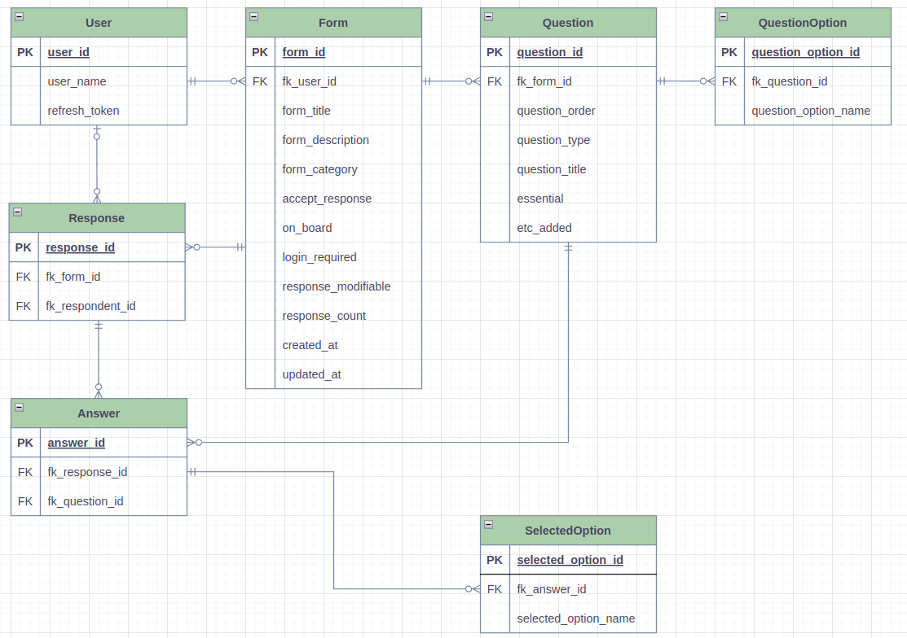

# web28-Boostform(Migration to MySQL)

MySQL 및 TypeORM 학습을 위한 프로젝트 입니다.

원본 프로젝트는 [해당 링크](https://github.com/boostcampwm-2022/web28-Boostform)를 참고하세요

## 프로젝트 내용

- RDBMS에 맞게 ERD 작성
- MySQL 및 TypeORM을 이용하여 설문지(Form) CRUD API 구현

## 진행 사항

- ERD
  
